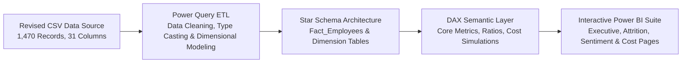

# HR Workforce, Attrition & Cost Analytics Dashboard
## Project Plan & Strategic Blueprint

---

### 1. Executive Summary

Employee turnover poses substantial financial and operational challenges to organizations, resulting in direct recruitment expenses, loss of institutional knowledge, operational friction, and diminished team morale. 

This project delivers an enterprise-grade **HR Workforce, Attrition & Cost Analytics Dashboard** built in **Power BI**, leveraging data-driven storytelling, robust dimensional modeling, and rigorous DAX calculations. The solution synthesizes employee demographics, job roles, compensation structures, performance metrics, and sentiment evaluations into strategic, actionable business intelligence for People Leaders, HR Business Partners, and C-Suite Executives.

---

### 2. Business Problem Statement

Organizations frequently struggle with reactive, fragmented retention strategies due to siloed HR reporting. Key organizational symptoms include:

- **Unanticipated Talent Attrition**: Critical departures across core revenue-generating and technical divisions (Sales, R&D) without early identification of leading indicators.
- **Hidden Cost of Turnover**: Underestimating the true financial toll of attrition, which encompasses not only lost compensation but substantial backfill recruitment, onboarding, and productivity disruption.
- **Burnout & Workload Friction**: Inability to isolate the empirical interaction between heavy overtime, frequent business travel, and employee flight risk.
- **Compensation & Career Inequity**: Lack of visibility into promotion stagnation, tenure plateaus, and salary discrepancies across job levels and departments.

---

### 3. Project Objectives

1. **Quantify Workforce Dynamics**: Establish centralized KPIs for global headcount (1,470), baseline attrition rate (16.12%), average tenure (7.0 years), and total annual payroll ($114.71M).
2. **Diagnose Attrition Drivers**: Isolate the primary risk factors (e.g., overtime, single marital status, entry-level job roles, compensation gaps, and low environment satisfaction) that drive voluntary departure.
3. **Model the Financial Impact**: Formulate dynamic DAX models to quantify departed salary exposure and compute estimated replacement costs using empirical industry multipliers.
4. **Empower Targeted Interventions**: Deliver multi-tiered, interactive Power BI report pages enabling executives and HR managers to drill down from global organizational trends to granular job roles and department cohorts.
5. **Portfolio-Grade Engineering**: Adhere to professional BI engineering best practices, including star schema data modeling, clean Power Query (M) transformations, organized DAX measure tables, and accessible, high-contrast visual design.

---

### 4. Key HR Analytical Questions

The dashboard is designed to answer fundamental, business-critical inquiries across 5 distinct analytical dimensions:

#### A. Workforce Composition & Demographic Profiling
- What is the global distribution of employees across departments, job roles, age groups, and education tiers?
- Does workforce composition reflect healthy diversity and experience depth across technical and commercial functions?
- How are talent tenure and experience distributed across the enterprise?

#### B. Attrition Risk & Turnover Diagnostics
- Which departments and specific job roles suffer from disproportionately elevated turnover rates (e.g., Sales Representatives at 39.8%, Laboratory Technicians at 23.9%)?
- How does mandatory or frequent overtime influence employee retention compared to non-overtime peers (30.5% vs. 10.4%)?
- What role does business travel intensity play in employee resignation patterns?
- Are junior and entry-level employees departing significantly faster than senior leaders, and at what tenure milestone do departures peak?

#### C. Employee Sentiment, Well-Being & Culture
- How directly do low scores in `EnvironmentSatisfaction`, `JobSatisfaction`, and `WorkLifeBalance` correlate with an employee's decision to exit?
- Is there a compounding risk when an employee experiences both low job involvement and poor manager tenure?
- What are the sentiment profiles of top performers (`Outstanding` ratings)? Are high performers at flight risk?

#### D. Compensation, Pay Equity & Financial Impact
- What is the total monthly and annualized payroll burden of departing employees ($13.61M annual salary churned)?
- What is the estimated replacement cost across high-risk roles using standard SHRM/Gallup replacement benchmarks (50% to 150% of annual salary)?
- Do stock option allocations (e.g., Level 0 vs. Levels 1–3) serve as an effective retention anchor?
- Is there salary parity across genders within comparable job levels and roles?

#### E. Mobility, Career Progression & Leadership Continuity
- Does promotion latency (years since last promotion) elevate attrition risk for mid-tenure talent?
- How does time spent with the current manager influence employee engagement and retention?
- How does past mobility (`NumCompaniesWorked`) impact likelihood of early departure?

---

### 5. Architecture & Technology Stack



- **Source Layer**: `data/IBM-HR-Analytics-Employee-Attrition-and-Performance-Revised.csv`
- **ETL & Data Transformation**: Power Query (M Language) for typed column casting, custom index keys, and ordinal sorting tables.
- **Data Modeling**: Star Schema dimensional architecture separating fact metrics from reusable dimensions (Employee, Role, Department, Sentiment, Geography/Commute).
- **Calculation Layer (DAX)**: Dedicated measure groups for Headcount, Attrition KPIs, Retention Rates, Tenure Statistics, Financial & Cost Impact, and What-If Simulation parameters.
- **Presentation Layer**: Power BI Desktop with modern executive dashboard UX/UI standards.
- **Version Control & Collaboration**: Git & GitHub with structured commit conventions and markdown documentation.

---

### 6. Expected Dashboard Sections

The Power BI solution will feature a coordinated, multi-page executive suite:

```
┌─────────────────────────────────────────────────────────────────────────┐
│              HR Workforce, Attrition & Cost Analytics Suite             │
├───────────────────┬───────────────────┬─────────────────┬───────────────┤
│ 1. Executive      │ 2. Attrition      │ 3. Sentiment &  │ 4. Cost &     │
│    Overview       │    Deep-Dive      │    Experience   │    Financials │
└───────────────────┴───────────────────┴─────────────────┴───────────────┘
```

#### Page 1: Executive Workforce Overview
- **Executive KPI Cards**: Total Active Headcount (1,470), Departures (237), Attrition Rate (16.1%), Total Monthly Payroll ($9.56M), Average Employee Age (36.9), Average Tenure (7.0 yrs).
- **Department & Role Breakdown**: Visual distribution of headcount and attrition split across R&D, Sales, and HR.
- **Demographic Matrix**: Age cohort pyramid, gender breakdown, marital status distribution, and educational attainment.
- **Interactive Global Slicers**: Department, Job Level, Gender, Business Travel, and Tenure bracket.

#### Page 2: Attrition & Flight Risk Diagnostics
- **Driver Comparison Charts**: Attrition rate side-by-side comparisons (OverTime Yes [30.5%] vs. No [10.4%]; Travel Frequently [24.9%] vs. Non-Travel [8.0%]).
- **Tenure & Promotion Curve**: Attrition volume plotted against `YearsAtCompany` and `YearsSinceLastPromotion` to pinpoint peak resignation milestones (e.g., years 1–3).
- **High-Risk Role Heatmap**: Cross-tabulation of Job Roles vs. Job Levels highlighted by attrition concentration (highlighting Sales Reps, Lab Techs, and Entry-level staff).
- **Manager Continuity Analysis**: Retention trends indexed against `YearsWithCurrManager`.

#### Page 3: Employee Sentiment & Workplace Experience
- **Sentiment Scorecard**: Visual ratings across 4 core survey dimensions:
  - Work Environment Satisfaction
  - Job Satisfaction
  - Relationship Satisfaction
  - Work-Life Balance
- **Attrition Correlation Matrix**: Departure percentage across sentiment grades (`Low` to `Very High`), isolating which sentiment domain has the sharpest inflection point.
- **Performance vs. Involvement Quadrant**: Analysis of `JobInvolvement` and `PerformanceRating` against retention to flag vulnerable top performers.
- **Overtime & Work-Life Interaction**: Bivariate chart demonstrating the compounding effect of Overtime and 'Bad' Work-Life Balance on exit probability.

#### Page 4: Compensation, Payroll & Cost Impact Analytics
- **Compensation Distribution**: Salary distribution curves and median income by Job Role, Job Level, and Department.
- **Lost Salary & Turnover Cost Model**:
  - Direct churned payroll calculation ($1.13M monthly / $13.61M annualized).
  - Dynamic replacement cost scenario calculation (e.g., conservative 50% vs. mid-range 100% of annual salary per departed employee).
- **Equity Retention Analysis**: Retention rates segmented across `StockOptionLevel` (0 vs. 1, 2, 3).
- **Pay Equity & Merit Analysis**: Relationship between `PercentSalaryHike`, performance rating, and retention.

---

### 7. Data Modeling & Governance Principles

1. **Zero Data Invention**:
   All metrics, charts, and DAX calculations will stem purely from the 1,470 validated employee records. No synthetic records or artificial inflation will be introduced.
2. **Dedicated DAX Measure Folders**:
   All calculations will reside in a dedicated `_Measures` table organized into structured display folders:
   - `01_Workforce_Metrics` (Headcount, Active Employees, Retained Counts)
   - `02_Attrition_Metrics` (Attrition Count, Attrition Rate %, Relative Risk)
   - `03_Financial_Metrics` (Payroll Totals, Churned Salary, Estimated Replacement Cost)
   - `04_Tenure_Mobility` (Avg Tenure, Promotion Latency, Role Age)
3. **Explicit Sort Order Dimensions**:
   Ordinal categorical values (such as `WorkLifeBalance`, `JobLevel`, `Education`, and Satisfaction indices) will have companion numeric sort keys to guarantee logical display order in all visuals.

---

### 8. Project Implementation Roadmap

| Phase | Focus Area | Deliverables | Status |
| :---: | :--- | :--- | :---: |
| **Phase 1** | **Foundation & Data Profiling** | Data Dictionary, Data Quality Assessment, Strategic Project Plan | **Complete** |
| **Phase 2** | **ETL & Data Modeling** | Power Query M transformations, Star Schema model, Ordinal sort mapping | Upcoming |
| **Phase 3** | **DAX Business Logic** | Measure hierarchy (Workforce, Attrition, Financial Replacement Model) | Upcoming |
| **Phase 4** | **Visual Design & UI/UX** | 4-page dashboard design, theme implementation, bookmark navigation | Upcoming |
| **Phase 5** | **Portfolio Documentation & Review** | README showcase, executive walkthrough, visual captures, final QA | Upcoming |
