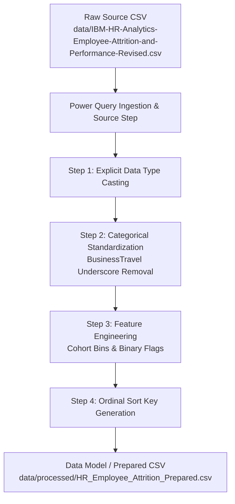

# HR Workforce, Attrition & Cost Analytics
## Power Query Data Preparation & Transformation Workflow

This document provides a reproducible, step-by-step ETL specification designed for **Power Query (M Engine)** in Power BI Desktop. It details type conversions, text standardization, derived cohort features, and the analytical rationale behind each transformation.

---

### 1. ETL Architecture & Governance Principles



- **Source Immutability**: The raw file (`data/IBM-HR-Analytics-Employee-Attrition-and-Performance-Revised.csv`) is preserved as a read-only source. It is never overwritten or altered.
- **Zero Loss of Records**: All 1,470 employee records are retained in full (0 dropped).
- **No Synthetic Identifiers**: In accordance with project standards, no fake employee IDs are invented.
- **Dual Availability**: The transformations documented here can be executed either natively in Power Query using the provided M script or loaded directly from the prepared dataset at `data/processed/HR_Employee_Attrition_Prepared.csv`.

---

### 2. Column Classification & Action Matrix

#### A. Columns Requiring Data Type Conversion
Power Query must enforce explicit typing upon ingestion to enable DAX aggregations and currency formatting:

| Column Name | Ingested Raw Type | Target Power Query Type | Target DAX Format | Technical & Business Rationale |
| :--- | :--- | :--- | :--- | :--- |
| `MonthlyIncome` | Text / Number | `Currency.Type` | Currency (`$#,##0`) | Represents core employee earnings; requires currency formatting for payroll and churn cost modeling. |
| `DailyRate` | Text / Number | `Currency.Type` | Currency (`$#,##0`) | Operational billing/labor rate. |
| `HourlyRate` | Text / Number | `Currency.Type` | Currency (`$#,##0`) | Operational hourly compensation rate. |
| `MonthlyRate` | Text / Number | `Currency.Type` | Currency (`$#,##0`) | Operational expense allocation rate. |
| `PercentSalaryHike` | Text / Number | `Int64.Type` | Percentage / Number | Merit increase percentage (11–25). |
| `Age` | Text / Number | `Int64.Type` | Whole Number | Continuous demographic age for averages and distribution histograms. |
| `DistanceFromHome` | Text / Number | `Int64.Type` | Whole Number | Commute distance in miles/km. |
| `NumCompaniesWorked`| Text / Number | `Int64.Type` | Whole Number | Count of prior employers. |
| `StockOptionLevel` | Text / Number | `Int64.Type` | Whole Number | Equity grant tier (0–3). |
| `TotalWorkingYears` | Text / Number | `Int64.Type` | Whole Number | Career experience count. |
| `TrainingTimesLastYear` | Text / Number | `Int64.Type` | Whole Number | Training sessions count. |
| `YearsAtCompany` | Text / Number | `Int64.Type` | Whole Number | Continuous tenure count. |
| `YearsInCurrentRole` | Text / Number | `Int64.Type` | Whole Number | Role tenure count. |
| `YearsSinceLastPromotion` | Text / Number | `Int64.Type` | Whole Number | Promotion latency count. |
| `YearsWithCurrManager` | Text / Number | `Int64.Type` | Whole Number | Manager relationship continuity count. |

#### B. Columns Requiring Cleaning & Text Standardization
| Column Name | Raw Values Observed | Cleaned / Target Values | Transformation Logic | Business Rationale |
| :--- | :--- | :--- | :--- | :--- |
| `BusinessTravel` | `Travel_Frequently`, `Travel_Rarely`, `Non-Travel` | `Travel Frequently`, `Travel Rarely`, `Non-Travel` | Replace `_` with a space | Eliminates internal database syntax in executive dashboard charts. |

#### C. Columns Remaining Unchanged
The following categorical columns are already clean, properly cased, and devoid of leading/trailing whitespaces:
- `Department` (`Human Resources`, `Research & Development`, `Sales`)
- `JobRole` (9 distinct role names)
- `Gender` (`Female`, `Male`)
- `MaritalStatus` (`Divorced`, `Married`, `Single`)
- `OverTime` (`No`, `Yes`)
- `Attrition` (`No`, `Yes`)
- `EducationField` (6 academic specializations)

---

### 3. Derived Fields & Feature Engineering

To facilitate intuitive dashboard slicing, cohort comparisons, and high-performance DAX measures, the following derived columns are generated:

#### 1. Binary Numeric Flags
- **`Attrition_Numeric`**:
  - *Logic*: `if [Attrition] = "Yes" then 1 else 0`
  - *Rationale*: Allows direct numerical aggregation (`SUM([Attrition_Numeric])`), accelerating DAX calculations without nested filter overhead.
- **`OverTime_Numeric`**:
  - *Logic*: `if [OverTime] = "Yes" then 1 else 0`
  - *Rationale*: Enables direct percentage calculation of overtime penetration across departments.

#### 2. Analytical Cohort Brackets
- **`Age_Group`**:
  - *Bins*: `<25`, `25-34`, `35-44`, `45-54`, `55+`
  - *Rationale*: Replaces continuous age with standard HR demographic bands for headcount pyramids.
- **`Tenure_Bracket`**:
  - *Bins*: `<1 Year (New Hire)`, `1-2 Years`, `3-5 Years`, `6-10 Years`, `10+ Years (Tenured)`
  - *Rationale*: Enables tenure-based churn analysis to highlight high-risk early career departure spikes.
- **`Distance_Bracket`**:
  - *Bins*: `Near (1-5 mi)`, `Moderate (6-15 mi)`, `Far (16+ mi)`
  - *Rationale*: Groups commute burden into distinct operational tiers to analyze commute-related flight risk.
- **`Salary_Bracket`**:
  - *Bins*: `<$3,000`, `$3,000-$4,999`, `$5,000-$7,999`, `$8,000-$11,999`, `$12,000+`
  - *Rationale*: Standardizes income tiers to evaluate attrition concentration in lower wage brackets.

#### 3. Companion Ordinal Sort Keys (Critical for Power BI Visuals)
By default, Power BI orders text alphabetically (e.g., `Bad` $\rightarrow$ `Best` $\rightarrow$ `Better` $\rightarrow$ `Good`, or `Entry Level` $\rightarrow$ `Executive Level`). Companion numeric sort keys ensure charts order logically:

| Text Dimension | Category Values | Companion Sort Key Name | Numeric Sort Order |
| :--- | :--- | :--- | :--- |
| `Education` | Below College, College, Bachelor, Master, Doctor | `Education_Sort` | 1, 2, 3, 4, 5 |
| `EnvironmentSatisfaction` | Low, Medium, High, Very High | `EnvironmentSatisfaction_Sort` | 1, 2, 3, 4 |
| `JobInvolvement` | Low, Medium, High, Very High | `JobInvolvement_Sort` | 1, 2, 3, 4 |
| `JobSatisfaction` | Low, Medium, High, Very High | `JobSatisfaction_Sort` | 1, 2, 3, 4 |
| `RelationshipSatisfaction` | Low, Medium, High, Very High | `RelationshipSatisfaction_Sort` | 1, 2, 3, 4 |
| `WorkLifeBalance` | Bad, Good, Better, Best | `WorkLifeBalance_Sort` | 1, 2, 3, 4 |
| `JobLevel` | Entry Level, Junior Level, Mid Level, Senior Level, Executive Level | `JobLevel_Sort` | 1, 2, 3, 4, 5 |
| `PerformanceRating` | Excellent, Outstanding | `PerformanceRating_Sort` | 3, 4 |

---

### 4. Complete Power Query (M) Script

Below is the complete M code that can be copied directly into the **Advanced Editor** in Power BI Desktop:

```powerquery
let
    // 1. Ingest raw CSV from source folder
    Source = Csv.Document(
        File.Contents("c:\Users\asus\OneDrive\Desktop\HR Analytics Project\data\IBM-HR-Analytics-Employee-Attrition-and-Performance-Revised.csv"),
        [Delimiter=",", Columns=31, Encoding=65001, QuoteStyle=QuoteStyle.None]
    ),
    PromoteHeaders = Table.PromoteHeaders(Source, [PromoteAllScalars=true]),

    // 2. Enforce explicit column data types
    TypedTable = Table.TransformColumnTypes(PromoteHeaders, {
        {"Age", Int64.Type},
        {"Attrition", type text},
        {"BusinessTravel", type text},
        {"DailyRate", Currency.Type},
        {"Department", type text},
        {"DistanceFromHome", Int64.Type},
        {"Education", type text},
        {"EducationField", type text},
        {"EnvironmentSatisfaction", type text},
        {"Gender", type text},
        {"HourlyRate", Currency.Type},
        {"JobInvolvement", type text},
        {"JobLevel", type text},
        {"JobRole", type text},
        {"JobSatisfaction", type text},
        {"MaritalStatus", type text},
        {"MonthlyIncome", Currency.Type},
        {"MonthlyRate", Currency.Type},
        {"NumCompaniesWorked", Int64.Type},
        {"OverTime", type text},
        {"PercentSalaryHike", Int64.Type},
        {"PerformanceRating", type text},
        {"RelationshipSatisfaction", type text},
        {"StockOptionLevel", Int64.Type},
        {"TotalWorkingYears", Int64.Type},
        {"TrainingTimesLastYear", Int64.Type},
        {"WorkLifeBalance", type text},
        {"YearsAtCompany", Int64.Type},
        {"YearsInCurrentRole", Int64.Type},
        {"YearsSinceLastPromotion", Int64.Type},
        {"YearsWithCurrManager", Int64.Type}
    }),

    // 3. Clean text formatting in BusinessTravel
    CleanBusinessTravel = Table.ReplaceValue(
        TypedTable,
        "Travel_",
        "Travel ",
        Replacer.ReplaceText,
        {"BusinessTravel"}
    ),

    // 4. Feature Engineering: Binary Flags
    AddAttritionNumeric = Table.AddColumn(CleanBusinessTravel, "Attrition_Numeric", each if [Attrition] = "Yes" then 1 else 0, Int64.Type),
    AddOverTimeNumeric = Table.AddColumn(AddAttritionNumeric, "OverTime_Numeric", each if [OverTime] = "Yes" then 1 else 0, Int64.Type),

    // 5. Feature Engineering: Demographic & Career Cohort Bins
    AddAgeGroup = Table.AddColumn(AddOverTimeNumeric, "Age_Group", each
        if [Age] < 25 then "<25"
        else if [Age] <= 34 then "25-34"
        else if [Age] <= 44 then "35-44"
        else if [Age] <= 54 then "45-54"
        else "55+", type text
    ),
    AddTenureBracket = Table.AddColumn(AddAgeGroup, "Tenure_Bracket", each
        if [YearsAtCompany] < 1 then "<1 Year (New Hire)"
        else if [YearsAtCompany] <= 2 then "1-2 Years"
        else if [YearsAtCompany] <= 5 then "3-5 Years"
        else if [YearsAtCompany] <= 10 then "6-10 Years"
        else "10+ Years (Tenured)", type text
    ),
    AddDistanceBracket = Table.AddColumn(AddTenureBracket, "Distance_Bracket", each
        if [DistanceFromHome] <= 5 then "Near (1-5 mi)"
        else if [DistanceFromHome] <= 15 then "Moderate (6-15 mi)"
        else "Far (16+ mi)", type text
    ),
    AddSalaryBracket = Table.AddColumn(AddDistanceBracket, "Salary_Bracket", each
        if [MonthlyIncome] < 3000 then "<$3,000"
        else if [MonthlyIncome] < 5000 then "$3,000-$4,999"
        else if [MonthlyIncome] < 8000 then "$5,000-$7,999"
        else if [MonthlyIncome] < 12000 then "$8,000-$11,999"
        else "$12,000+", type text
    ),

    // 6. Companion Ordinal Sort Key Columns
    AddEducationSort = Table.AddColumn(AddSalaryBracket, "Education_Sort", each
        if [Education] = "Below College" then 1
        else if [Education] = "College" then 2
        else if [Education] = "Bachelor" then 3
        else if [Education] = "Master" then 4
        else if [Education] = "Doctor" then 5
        else 0, Int64.Type
    ),
    AddEnvSatSort = Table.AddColumn(AddEducationSort, "EnvironmentSatisfaction_Sort", each
        if [EnvironmentSatisfaction] = "Low" then 1
        else if [EnvironmentSatisfaction] = "Medium" then 2
        else if [EnvironmentSatisfaction] = "High" then 3
        else if [EnvironmentSatisfaction] = "Very High" then 4
        else 0, Int64.Type
    ),
    AddJobInvSort = Table.AddColumn(AddEnvSatSort, "JobInvolvement_Sort", each
        if [JobInvolvement] = "Low" then 1
        else if [JobInvolvement] = "Medium" then 2
        else if [JobInvolvement] = "High" then 3
        else if [JobInvolvement] = "Very High" then 4
        else 0, Int64.Type
    ),
    AddJobSatSort = Table.AddColumn(AddJobInvSort, "JobSatisfaction_Sort", each
        if [JobSatisfaction] = "Low" then 1
        else if [JobSatisfaction] = "Medium" then 2
        else if [JobSatisfaction] = "High" then 3
        else if [JobSatisfaction] = "Very High" then 4
        else 0, Int64.Type
    ),
    AddRelSatSort = Table.AddColumn(AddJobSatSort, "RelationshipSatisfaction_Sort", each
        if [RelationshipSatisfaction] = "Low" then 1
        else if [RelationshipSatisfaction] = "Medium" then 2
        else if [RelationshipSatisfaction] = "High" then 3
        else if [RelationshipSatisfaction] = "Very High" then 4
        else 0, Int64.Type
    ),
    AddWlbSort = Table.AddColumn(AddRelSatSort, "WorkLifeBalance_Sort", each
        if [WorkLifeBalance] = "Bad" then 1
        else if [WorkLifeBalance] = "Good" then 2
        else if [WorkLifeBalance] = "Better" then 3
        else if [WorkLifeBalance] = "Best" then 4
        else 0, Int64.Type
    ),
    AddJobLevelSort = Table.AddColumn(AddWlbSort, "JobLevel_Sort", each
        if [JobLevel] = "Entry Level" then 1
        else if [JobLevel] = "Junior Level" then 2
        else if [JobLevel] = "Mid Level" then 3
        else if [JobLevel] = "Senior Level" then 4
        else if [JobLevel] = "Executive Level" then 5
        else 0, Int64.Type
    ),
    AddPerfRatingSort = Table.AddColumn(AddJobLevelSort, "PerformanceRating_Sort", each
        if [PerformanceRating] = "Excellent" then 3
        else if [PerformanceRating] = "Outstanding" then 4
        else 0, Int64.Type
    )
in
    AddPerfRatingSort
```

---

### 5. Production Dataset in `data/processed/`

For analysts or consumers who prefer loading a pre-transformed dataset directly, the prepared dataset is structured as follows:

- **File Location**: [`data/processed/HR_Employee_Attrition_Prepared.csv`](file:///c:/Users/asus/OneDrive/Desktop/HR%20Analytics%20Project/data/processed/HR_Employee_Attrition_Prepared.csv)
- **Record Count**: 1,470 rows (exact 100% preservation of raw source records).
- **Attribute Count**: 45 columns (31 original attributes + 14 engineered analytical features and sort keys).
- **Data Lineage**: Follows the identical step-by-step logic outlined in the Power Query M recipe above.
